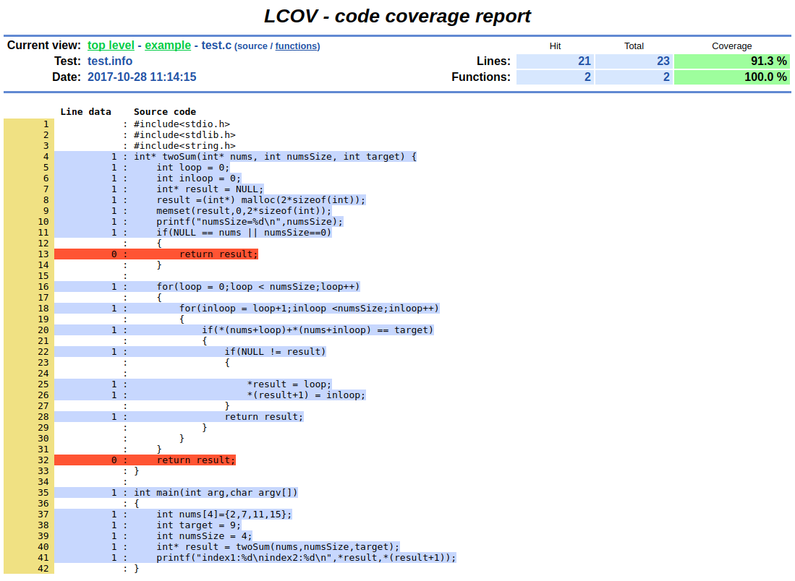

# 示例
- 测试代码
创建测试代码 `vim test`

- 编译
`gcc -fprofile-arcs -ftest-coverage test.c -o test`
会生成`.gcno`文件

- 运行
`./test`
生成`.gcna`文件

- 转换覆盖信息
`lcov -c -o test.info -d .`
	- `-c`：生成覆盖率信息
	- `-o`：生成目标文件
	- `-d`：目录
	- `.`：当前目录

会生成`.c.gcov`和`.info`文件

- 生成html报告文档
`genhtml test.info -o ./output`
	- `test.info`：用来生成报告的源文件
	- `-o`：生成结果的目录

之后产生`ouput`文件夹，里面包含了覆盖率报告

# 简介
[源码](./SourceCode/gcc.c)
[shili](#示例)